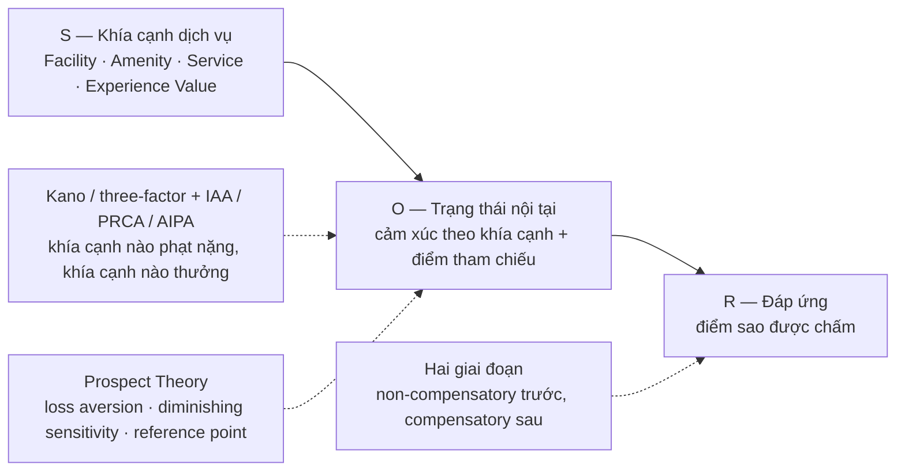

# Lý thuyết Nền tảng (notes/theory/)

Bốn lớp lý thuyết của đề tài, viết ở mức **đủ để hiểu dự án và đủ để tự tin vấn đáp**. Khung đã khóa tại [`RDR-0005`](../../docs/decisions/RDR-0005_close_survey_and_lock_framework.md) mục 2.4 — không lớp nào ở đây là lựa chọn mở.

Đây là **tài liệu sống**: sửa được, cập nhật được như `notes/`. Khác với `docs/logs/**` — nhật ký là bản chụp bất biến.

- **Cập nhật:** 2026-09-23.

---

## 1. Bốn lớp và việc chúng làm

| Lớp | Vai trò trong lập luận | Câu hỏi nó trả lời | Ghi chú |
| --- | --- | --- | --- |
| **S-O-R** | Khung vĩ mô, kế thừa bài gốc | Trải nghiệm đi vào và đi ra đánh giá bằng đường nào? | [`01_sor_framework.md`](01_sor_framework.md) |
| **Kano / three-factor + Impact Asymmetry (IAA / PRCA / AIPA)** | Cơ chế bất đối xứng ở cấp khía cạnh | Khía cạnh nào phạt nặng hơn thưởng, khía cạnh nào ngược lại? | [`02_kano_three_factor_iaa.md`](02_kano_three_factor_iaa.md) |
| **Prospect Theory** | Cơ chế tâm lý của trọng số | Vì sao mất mát nặng hơn được lợi, và vì sao tác động biên không tuyến tính? | [`03_prospect_theory.md`](03_prospect_theory.md) |
| **Non-compensatory → compensatory** | Cấu trúc quyết định | Điểm tổng được cộng gộp theo trình tự nào, chỗ nào bị cắt tỉa? | [`04_two_stage_decision.md`](04_two_stage_decision.md) |

## 2. Bốn lớp nối với nhau thế nào

Đọc theo một câu: **S** là các khía cạnh khách gặp, **O** là cảm xúc khách tạo ra quanh một điểm tham chiếu, **R** là con số họ bấm. Ba lớp dưới không thay S-O-R; chúng nói **bên trong O và R có gì**.

Mỗi lớp chặn một sai lầm cụ thể:

1. **S-O-R** chặn việc coi rating là thước đo cảm xúc — $R$ là hành vi, $O$ mới là cảm xúc, hai thứ có thể lệch nhau. Đó chính là biến phụ thuộc của đề tài.
2. **Kano + IAA/PRCA/AIPA** chặn việc mô hình hóa mọi khía cạnh bằng một hệ số đối xứng.
3. **Prospect Theory** chặn diễn giải trạng thái tâm lý: chiều bị dìm điểm giải thích được bằng *loss dominance* mà không cần gán nhãn `Anger` cho người viết.
4. **Hai giai đoạn** chặn việc coi điểm tổng là một tổng có trọng số tuyến tính.

## 3. Đọc theo thứ tự nào

| Thời lượng | Việc |
| --- | --- |
| 10 phút | Mục 2 ở trên + [`../glossary.md`](../glossary.md) mục 1–2 để nắm từ vựng |
| 60 phút | Bốn tệp `01`–`04`, đọc mục "Vai trò trong đề tài" và "Câu hỏi bảo vệ" trước, chi tiết nguồn sau |
| 20 phút | Mục 4 dưới đây — đọc trước khi viết bất kỳ câu nào cho báo cáo |

## 4. Bốn câu không được viết

Bốn điều này không phải khuyến nghị văn phong, mà là giới hạn của dữ liệu. Vi phạm chúng là điểm trừ trực tiếp khi bảo vệ.

1. **Không suy ra trạng thái tâm lý từ review công khai.** Không viết "khách tha thứ", "khách phẫn nộ". Review công khai không cho phép nhận dạng trạng thái tâm lý (`RDR-0005` mục 2.5; phản biện Han & Anderson 2025 · Sterner 2026).
2. **Không viết "penalty luôn thắng".** Khung đúng là hai nhánh **có điều kiện**; chính nguồn phản biện trong thư viện xác nhận điều này (Li, J. et al. 2025 ở vai D4).
3. **Phân loại khía cạnh theo Kano là phân tích khám phá**, phải báo cáo kèm bất định — không phải construct đã kiểm định (Slevitch 2024, phê bình quy trình phân loại).
4. **$D > 0$ không phân biệt được bù trừ thật với thiên lệch trình bày.** Đây là hạn chế nhận dạng, phải ghi tường minh, không phải lỗi cẩu thả (Han & Anderson 2025 · Sterner 2026 · Mellinas et al. 2025).

Kèm theo: mọi tuyên bố về tỷ lệ phải ghi đúng phạm vi — **TripAdvisor, 2015–2023, 9.990 review đã gán nhãn**.

## 5. Nhà của con số, và chỗ đối chiếu

Ghi chú ở thư mục này **không sở hữu số liệu**. Khi cần con số gốc hoặc bản đầy đủ, tra theo thứ tự:

1. [`refs/INDEX.md`](../../refs/INDEX.md) — danh mục 8 cụm chức năng; `SOURCES.md` trong từng cụm là bản ghi dữ liệu của cụm đó (có `cite`, `doi`, `evidence_level`, `role`).
2. `refs/<cụm>/md/*.md` — bản markdown toàn văn của từng bài, trùng tên PDF. Dùng để đối chiếu nguyên văn một phát biểu.
3. [`../reference_map.md`](../reference_map.md) — bản đồ đọc nhanh: mỗi ref tóm tắt gì, dùng cho phần nào.
4. Nhật ký khảo sát — [`0005`](../../docs/logs/literature_survey/0005_survey_matrix_round_3_rq3_rescoping.md) (Round 3, nơi cơ chế asymmetric compensation ra đời) và [`0006`](../../docs/logs/literature_survey/0006_survey_matrix_round_4.md) (Round 4, ma trận 26 nguồn + checkpoint phản biện).
5. [`../pillar_strength.md`](../pillar_strength.md) — độ mạnh bằng chứng theo trụ cột, biết chỗ nào còn mỏng.

## 6. Nguồn kinh điển và trạng thái của chúng

Mỗi tệp lý thuyết đều phân biệt hai loại nguồn: **nguồn kinh điển** (bài gốc của lý thuyết) và **nguồn trong thư viện** (bài đã tải, đã xác minh DOI). Nguồn kinh điển được dẫn **qua** bài trong thư viện, không phải đọc trực tiếp — nghĩa là:

- Được phép viết: "theo cách X et al. (năm) dẫn lại, lý thuyết này hình thành từ ...".
- Chưa đủ căn cứ để viết: bất kỳ chi tiết nào chỉ có ở bản gốc mà bài trong thư viện không thuật lại.
- Muốn trích bản gốc trong báo cáo: đưa vào hàng đợi lấy toàn văn ở [`refs/INDEX.md`](../../refs/INDEX.md) mục 9, đừng tự khai mở vòng quét mới (`RDR-0005` mục 2.3).
